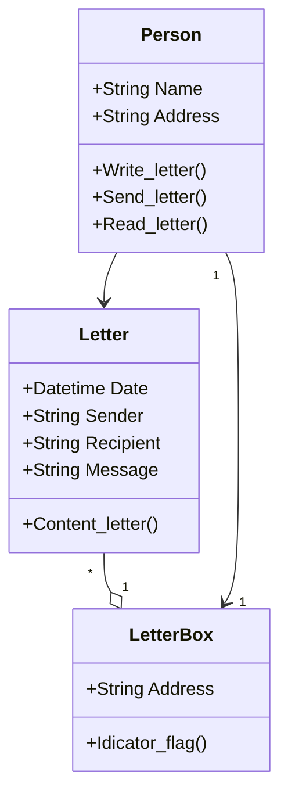
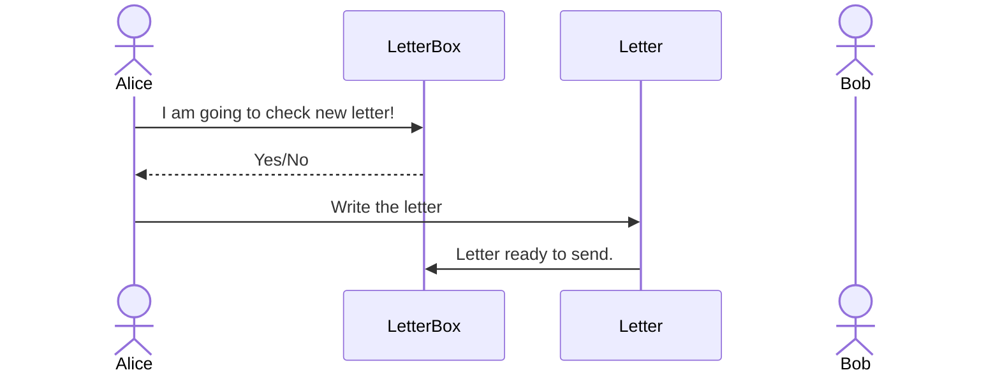
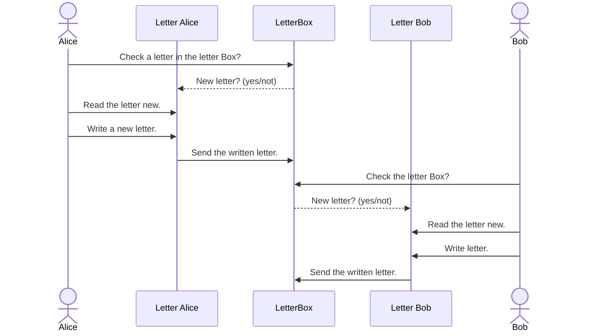
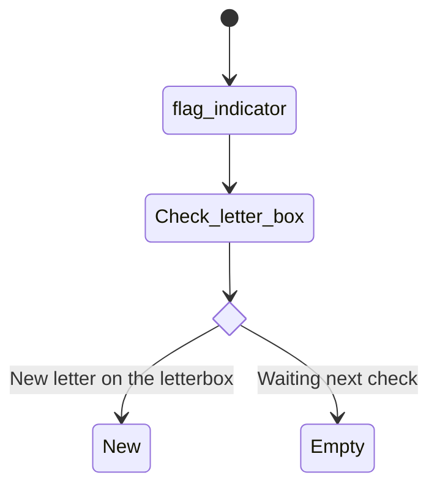
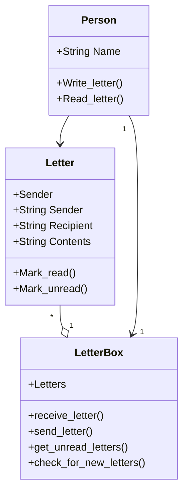

#### Jesus Huanambal
#### Id 20096888

# My project "Post Letter"

```mermaid
classDiagram
    class Person {
        +String Name
        +String Address
        +Write_letter()
        +Send_letter()
        +Read_letter()
    }
    class Letter{
        +Datetime Date
        +String Sender
        +String Recipient
        +String Message
        +Content_letter()
    }
    class LetterBox{
        +String Address
        +Idicator_flag()
    }
    Letter "*" --o "1" LetterBox
    Person "1"--> "1" LetterBox
    Person --> Letter
```
## Sequence Diagram "Post Letter" 

```mermaid
sequenceDiagram
    actor Alice
    participant Alice_Letter as LetterBox
    participant Letter
    Alice ->> Alice_Letter: I am going to check new letter! 
    Alice_Letter -->> Alice: Yes/No
    
   Alice ->> Letter: Write the letter
   Letter ->>  Alice_Letter: Letter ready to send.
   
   actor Bob
  
   

```

``` mermaid
sequenceDiagram
   
        actor Alice
        participant Alice_Letter as Letter Alice
        participant LetterBox
        participant Bod_Letter as Letter Bob
        
        Alice ->> LetterBox: Check a letter in the letter Box?
        LetterBox -->> Alice_Letter: New letter? (yes/not)
        Alice ->> Alice_Letter: Read the letter new.
        Alice ->> Alice_Letter: Write a new letter.
        Alice_Letter ->> LetterBox: Send the written letter.
      
        actor Bob
        Bob ->> LetterBox: Check the letter Box?
        LetterBox -->> Bod_Letter: New letter? (yes/not)
        Bob ->> Bod_Letter: Read the letter new.
        Bob ->> Bod_Letter: Write letter.
        Bod_Letter ->> LetterBox: Send the written letter.
       
```
## State diagram Letter box

```mermaid
stateDiagram-v2
    state if_state <<choice>>
    [*]--> flag_indicator
    flag_indicator--> Check_letter_box
    Check_letter_box -->if_state
    if_state --> New:New letter on the letterbox
    if_state --> Empty: Waiting next check
```

# UPDATE CLASS DIAGRAM

```mermaid
classDiagram
    class Person {
        +String Name
        +Write_letter()
        +Read_letter()
    }
    class Letter{
        +Sender
        +String Sender
        +String Recipient
        +String Contents
        +Mark_read()
        +Mark_unread()
    }
    class LetterBox{
        +Letters
        +receive_letter()
        +send_letter()
        +get_unread_letters()
        +check_for_new_letters()
    }
    Letter "*" --o "1" LetterBox
    Person "1"--> "1" LetterBox
    Person --> Letter
```
